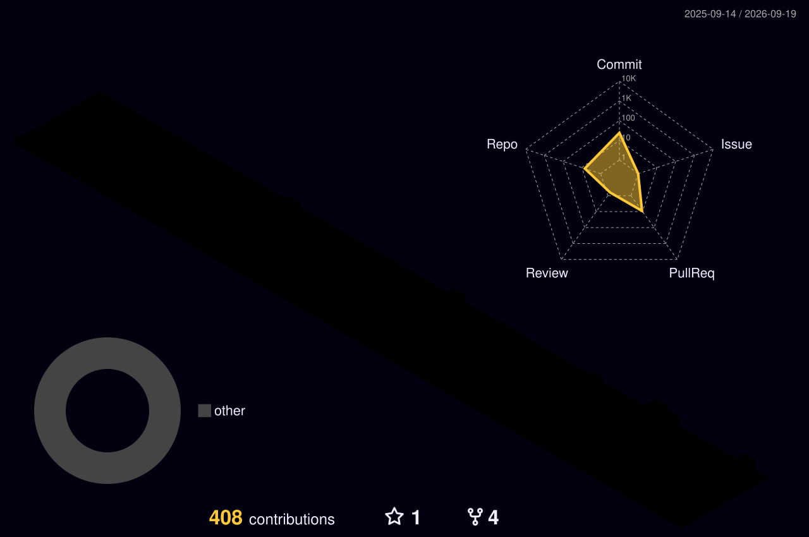

<h1 align="center">Olá, eu sou o Rafael 👋</h1>

  <b>Dev fullstack</b> · backend de integrações em produção, frontend quando a batalha pede

  <i>Sistemas distribuídos · alta carga · performance</i>

  <picture>
    <source media="(prefers-color-scheme: dark)"
      srcset="https://raw.githubusercontent.com/muguetdev/muguetdev/output/github-snake-dark.svg" />
    <source media="(prefers-color-scheme: light)"
      srcset="https://raw.githubusercontent.com/muguetdev/muguetdev/output/github-snake.svg" />
    
  </picture>

### ⚙️ Backend

  
  
  
  
  

### 🎨 Frontend

  
  
  
  
  

### 🗄️ Dados & Infra

  
  
  
  

  
  
  
  

### 🧠 Sistemas & Nativo

  
  
  
  
  

### 📈 Contribuições em 3D

  

